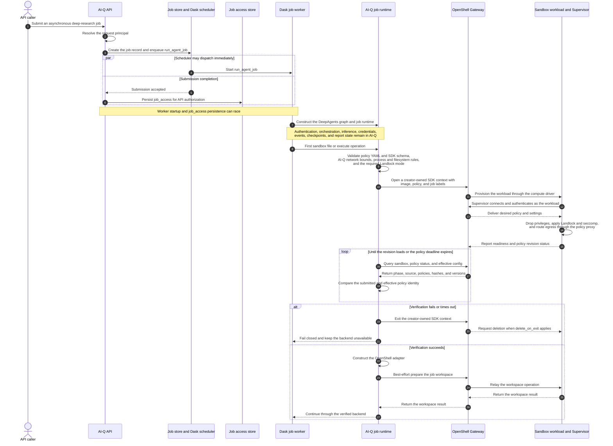
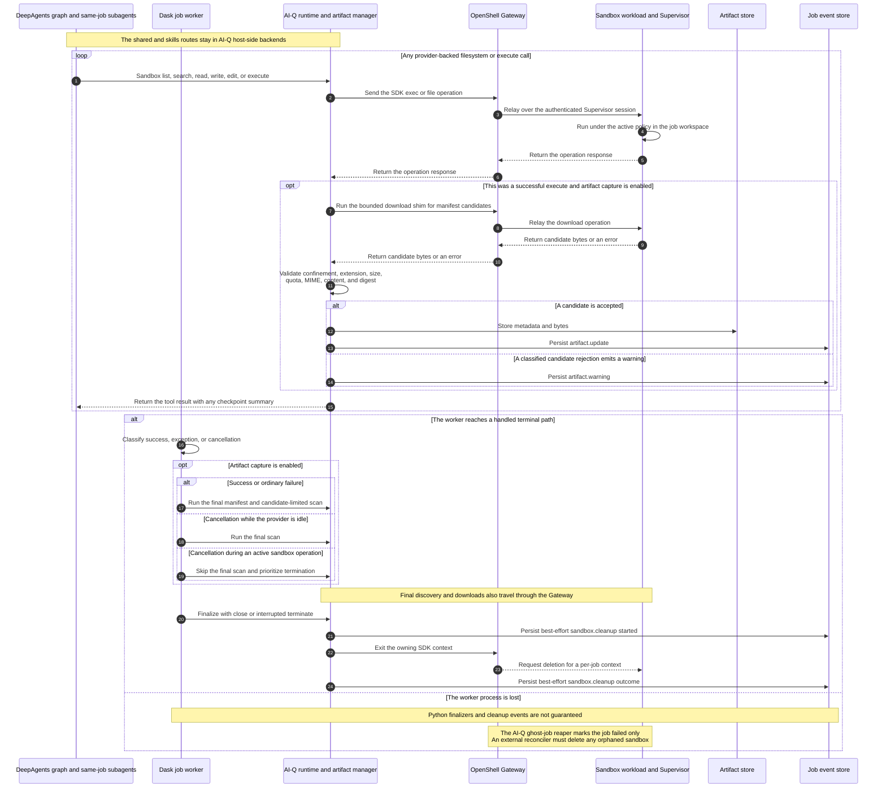

<!--
SPDX-FileCopyrightText: Copyright (c) 2025-2026, NVIDIA CORPORATION & AFFILIATES. All rights reserved.
SPDX-License-Identifier: Apache-2.0
-->

# Deep Research Sandbox + Artifact Runtime

Provider-neutral sandbox execution for agent-generated code, plus a durable artifact
runtime that harvests generated files (charts, CSVs, notebooks) so they survive the
sandbox and can be served to the UI, embedded in reports, or downloaded via the skill CLI.

Design pattern: **sandbox-as-tool**. AI-Q keeps authentication, orchestration,
inference, data-source tools, checkpoints, events, and report state in its API and
worker processes; only generated code runs in the provider sandbox. AI-Q does not
copy its host environment, inference keys, or data-source credentials into the
sandbox creation request.

## Architecture

```text
config YAML (sandbox.provider + providers.<name>)
        -> SandboxConfig (config.py)
        -> registry.create_sandbox_backend  --(fail-closed capability gate)-->  SandboxProvider
                                                                                     |
DeepAgentsRuntime (deepagents_runtime.py) holds the provider and composes:           |
   CompositeBackend(default = provider, routes = {/shared/ -> StateBackend, /skills/ -> FilesystemBackend})
        - workdir (default route): real sandbox FS, reached through the provider's
          execute/upload primitives. The EFFECTIVE workdir is per-job:
          <configured workdir>/<job_id> (e.g. /sandbox/<job_id>), with artifacts nested
          at <job_id>/aiq-artifacts. See "Workspace isolation" below.
        - /shared/: host-side StateBackend for durable job text
        - /skills/: host-side virtual-mode FilesystemBackend for built-in skills
   ArtifactManager (artifacts/manager.py):
        download_files -> validate -> ArtifactStore -> job event store -> SSE/API
```

## Workspace organization and isolation limits

The effective working directory is scoped per job to `<configured workdir>/<job_id>`, and
the artifact directory is nested under it at `<job_id>/aiq-artifacts`. The provider base
creates these on session start (`_prepare_workspace`, an idempotent `mkdir -p`) and the
runtime injects them into prompts/skills as `sandbox_workdir`/`sandbox_artifact_dir`. This
prevents accidental filename collisions and keeps harvesting scoped to the current job.

In normal per-job mode, all agents and subagents in a job share one job-scoped provider
object and workspace; a different job constructs a different provider object. Physical
session creation remains lazy until the first provider-backed operation. The common
session lifecycle and each provider's distinct creation, security, and deletion
semantics are described under [Providers](#providers).

With sandbox execution enabled, the agent graph's filesystem/code tool set is `ls`,
`glob`, `grep`, `read_file`, `write_file`, `edit_file`, and `execute`. For job-workspace
paths on the default route, DeepAgents derives listing, search, read, write, and edit
operations from the provider's `execute` and `upload_files` primitives; direct `execute`
also uses the provider.
`/shared/` and `/skills/` route path-based filesystem calls to host-side backends instead.
Binary artifacts are harvested host-side through the provider's `download_files`
implementation and referenced in reports as `artifact://<id>` (never base64).

## Module map

| File | Purpose |
|---|---|
| `base.py` | `SandboxProvider` ABC. Provider subclasses supply session creation and capabilities; the base delegates `execute`/`upload_files`/`download_files` and owns lazy single-flight creation, serialization, idempotency-gated retry, `close()`, and `terminate()`. |
| `registry.py` | `register_sandbox_provider` / `create_sandbox_backend` (config-driven dispatch + capability gate). |
| `config.py` | `SandboxConfig`: common fields + nested `providers.<name>` + `artifact_capture` + `lifecycle_scope`; legacy flat-config shim; provider validated against the registry. |
| `capabilities.py` | `SandboxCapabilities` + `verify_capabilities` (fail-closed: refuse to run if a required guarantee like `block_network` is unsupported). |
| `providers/openshell.py` | OpenShell provider (enterprise/on-prem). Lazy, ad-hoc deps; per-job policy creation, readiness/revision verification, and confined transfer. |
| `providers/modal.py` | Modal provider (cloud). Create-fresh semantics (no silent attach-by-name). |
| `artifacts/models.py` | `Artifact` record (id, mime, sha256, size, provenance, status). Metadata only. |
| `artifacts/manifest.py` | `manifest.json` schema + parser. |
| `artifacts/store.py` | `SqlArtifactStore` coordinates SQL metadata with the configured byte provider. |
| `artifacts/blob_store.py` | Byte adapters for SQL BLOBs and S3-compatible object storage. |
| `artifacts/factory.py` | Builds the application store from `AIQ_ARTIFACT_*` environment variables. |
| `artifacts/manager.py` | Harvest pipeline: manifest-first + scan, path-traversal confinement, MIME-from-bytes, active-content rejection, render-gate, quotas, dedup, store-then-emit, `artifact://` resolution. |

## Adding a provider (the whole surface)

```python
from deepagents.backends.sandbox import BaseSandbox
from ..base import SandboxProvider
from ..capabilities import SandboxCapabilities
from ..registry import register_sandbox_provider

class MySandboxProvider(SandboxProvider):
    provider_name = "mybox"

    @classmethod
    def _scoped_name(cls, job_id: str) -> str:
        return job_id                      # apply provider naming rules

    @property
    def capabilities(self) -> SandboxCapabilities:
        return SandboxCapabilities(supports_network_policy=True, supports_artifact_download=True)

    def is_recoverable_error(self, exc: Exception) -> bool:
        return False                       # classify stale/transient errors for retry

    def _create_session(self) -> BaseSandbox:
        # lazy-import your SDK; create/attach a job-scoped sandbox; return a BaseSandbox.
        ...

register_sandbox_provider("mybox", MySandboxProvider)
```

Add a `MyProviderConfig` sub-model to `SandboxProvidersConfig` in `config.py`. You do
NOT implement `ls`/`glob`/`grep`/`read_file`/`write_file`/`edit_file` (inherited from
`BaseSandbox` on top of the session's execute/upload primitives) or the
retry/lock/lifecycle (the base owns those). Every provider must pass the compliance
suite (`tests/.../sandbox/test_provider_compliance.py`).

### Out-of-tree providers (entry points)

Third-party packages contribute providers without editing AI-Q by declaring the
`aiq.sandbox_providers` entry-point group (the same plug-in pattern as NAT and
deepagents Code). They are discovered lazily on first registry use:

```toml
# in the third-party package's pyproject.toml
[project.entry-points."aiq.sandbox_providers"]
mybox = "my_pkg.provider:MySandboxProvider"
```

The entry-point name becomes the config `provider` key. A broken plugin is logged and
skipped — it can never break resolution of the built-in providers.

## Internal normalized `SandboxConfig`

The following YAML represents the internal provider-neutral
`sandbox.config.SandboxConfig` built by `_create_sandbox_backend` after AI-Q validates
and maps the public `deep_research_sandbox` function config. It is an implementation
reference, **not valid workflow YAML**; do not paste it under `functions:` or
`deep_research_agent.sandbox` in a `configs/config_*.yml` file.

For accepted public syntax, use the shipped
[`configs/config_openshell.yml`](../../../../../configs/config_openshell.yml) profile.
The public surface uses flat fields such as `network: allowlist`, `network_allow`,
`openshell_image`, and `packages`. The runtime maps them to internal fields such as
`network.mode`, `network.allow`, and `providers.<name>`; internal-only fields shown
below, including `resources`, are not accepted by the public function schema.

```yaml
enabled: true
provider: openshell          # registry key
workdir: /sandbox            # injected into prompts + skills
network:                     # normalized, provider-neutral egress policy
  mode: allowlist            # blocked | allowlist | open  (legacy `block_network: true` => blocked)
  allow: [api.github.com, github.com]  # policy grants must be a subset of this list
timeout: 1200
idle_timeout: 1800
resources: {}                # optional CPU/memory caps; empty requests no limits
artifact_capture:
  enabled: true              # requires supports_artifact_download
  max_file_bytes: 50000000
  allow_extensions: [.png, .jpg, .jpeg, .webp, .csv, .json, .md, .ipynb, .pdf]
providers:
  openshell:
    gateway: null            # null = locally selected gateway
    workspace: default       # OpenShell lifecycle scope (not the in-sandbox workdir)
    image: aiq-openshell-demo:latest
    policy: configs/openshell/generated/aiq-openshell-policy.yaml
    delete_on_exit: true
    attest: true
    policy_load_timeout_seconds: 30
    # Bounds a teardown wait that races with SDK context creation;
    # normal SDK context exit has no AI-Q deadline.
    cleanup_timeout_seconds: 30
    # expected_policy_version: 1
    require_hard_landlock: true
  modal:
    app_name: aiq-deep-research
    image: python:3.12-slim
    python_packages: [matplotlib, numpy, pandas, pillow, tabulate]
```

Within this internal model, the legacy flat Modal shape (top-level
`app_name`/`image`/`python_packages`) still loads and is lifted into
`providers.modal`.

## Artifact runtime

- Generated code writes binaries + a `manifest.json` to `artifact_dir`.
- Successful `execute` calls trigger a manifest-only checkpoint. Terminal finalization runs
  one manifest + directory scan on success or failure. On cancellation, that scan runs only
  when the provider operation lease is immediately available; terminal handling prioritizes
  termination for a busy sandbox, while completed execute outputs remain preserved by earlier
  checkpoints.
- Before downloading, the `ArtifactManager` checks path-traversal confinement, the
  extension allowlist, and the artifact-count quota. It then pulls bytes via
  `download_files`, applies the size cap, cumulative-byte quota, MIME-from-bytes/spoof
  rejection, active-content rejection, and SHA-256 hashing, stores metadata in SQL and
  bytes through the configured artifact blob provider, then emits an
  `artifact.update` event (durable metadata + `content_url`, never bytes or URL-as-text).
- Reports reference artifacts as ``; the report
  postprocessor rewrites filename refs to durable ids and drops unknown/foreign refs.
- Endpoints: `GET /v1/jobs/async/job/{job_id}/artifacts` and `.../artifacts/{id}/content`
  (auth-scoped via `authorize_job_access`). CLI: `python3 skills/aiq-research/scripts/aiq.py artifacts <job_id> [--download-dir DIR]`.
- Render gate: only PNG/JPEG/WebP may render inline. SVG is rejected until a vetted
  sanitizer exists; notebooks and PDFs are download-only.
- Transfer guards (artifacts come from an untrusted sandbox): the OpenShell download
  bootstrap fails closed BEFORE reading bytes - it rejects symlink escapes (`realpath`
  differs from the lexical path: leaf or parent), directories, and files over
  `max_file_bytes` - so a hostile sandbox cannot pull an out-of-tree or oversized file
  into host memory. The harvest also count-gates before each download and bounds the
  number of scan candidates it processes after enumeration, and decoded bytes are
  base64-validated. SQL is fully parameterized and the content endpoint is auth-scoped
  per job with `nosniff` + RFC 5987 filenames.

### Report post-processing (host-side, in `agent.run`)

Run once after the report is produced, reusing a single artifact fetch:
- `resolve_report_references` - rewrite `artifact://<filename>` to `artifact://<id>`; drop unknown/foreign refs.
- `ensure_inline_artifacts_embedded` - append a `## Figures` section embedding any produced
  inline image the model forgot to reference (so every harvested inline chart surfaces).
- `append_artifact_index` - append a `## Generated Artifacts` list crediting every harvested
  file (charts and their backing CSVs), alongside the external `## Sources`.

### Rendering surfaces

The stored report keeps `artifact://<id>`; each surface resolves it at its own edge (one
shared helper, `MarkdownRenderer/artifact-url.ts`, builds the content path):
- **UI report**: `MarkdownRenderer` preserves the `artifact://` scheme via a custom
  `urlTransform` (react-markdown would otherwise blank a non-standard scheme), and an `img`
  renderer rewrites it to the same-origin `/api/jobs/async/job/{job_id}/artifacts/{id}/content`
  (the Next proxy streams bytes through). Job id comes from `selectResolvedDeepResearchJobId`.
- **PDF export**: `/api/generate-pdf` fetches each artifact server-side and inlines it as a
  `data:` URI (<= 8 MiB); `ReactPdfDocument` renders raster images as block figures (paragraphs
  and list items). Non-image refs are skipped.
- **Markdown download**: `artifact://` is rewritten to an absolute content URL so the `.md`
  renders while the backend is reachable.
- **Skill/CLI**: `aiq.py report <job_id> --out-dir DIR` writes `report.md` plus an
  `artifacts/` folder and rewrites links to local files (portable, renders offline).

## Providers

### Shared AI-Q provider lifecycle

OpenShell and Modal plug into the same provider-neutral `SandboxProvider` and
`DeepAgentsRuntime` lifecycle. AI-Q, rather than either provider SDK, owns these
behaviors:

- **Job scope and lazy creation:** the runtime constructs one logical provider per job.
  Same-job subagents share it, and the first provider-backed operation creates its
  physical session through a single-flight path.
- **Call serialization and retry:** one operation lock serializes provider-backed calls.
  `execute` is never replayed. An idempotent upload or download may replace the physical
  session and retry once only when that provider classifies the error as recoverable.
- **Artifact capture:** successful `execute` calls can checkpoint manifest-declared
  artifacts. Success and ordinary failure paths run the final manifest plus
  candidate-limited scan; cancellation runs it only when the provider operation lease is
  immediately available.
- **Terminal handling:** handled normal paths call idempotent `close()`; interrupted
  paths call idempotent `terminate()` without waiting behind an active provider call.
  Best-effort `sandbox.cleanup` events record the call outcome, not independent proof
  that the remote resource no longer exists.

The shared contract stops at the provider boundary. Physical naming, creation or
attachment, security controls, transport, and resource deletion remain provider-specific.
The sections below describe those differences; they do not redefine the common lifecycle.

### OpenShell (experimental)

OpenShell uses the shared lifecycle above and adds fail-closed policy validation,
control-plane verification, and Gateway-Supervisor enforcement. The sequence diagrams
retain the common AI-Q runtime, artifact, and terminal steps to show the handoff points;
the Gateway-Supervisor transport and policy verification are OpenShell-specific.

#### Boundary model

AI-Q uses OpenShell as a job-scoped sandbox-as-tool boundary. It is important not to
collapse four different identities into the word "user":

| Boundary | Meaning in AI-Q |
|---|---|
| API principal | The caller identity used for job, report, and artifact authorization when `REQUIRE_AUTH=true`. When authentication is disabled, AI-Q synthesizes a principal for audit records but does not enforce job ownership on reads. |
| Deep-research job | One asynchronous execution dispatched through Dask. The worker constructs one DeepAgents graph and one job-scoped runtime for that execution. A job is not a long-lived user session. |
| OpenShell sandbox | In normal per-job mode, a physical execution resource owned by one job. Agents and subagents in that job share its serialized backend; a different job receives a different sandbox. |
| Tenant | An administrative and security boundary above jobs. AI-Q does not implement tenant sandbox pools, tenant-specific Gateways, leases, or tenant quotas in this provider. A sandbox is not itself a tenant. |

The API principal and the OpenShell control-plane identity are separate. AI-Q passes
the owner user ID to the worker for per-user host-side tool resolution, but does not
put that identity in the OpenShell `SandboxSpec`, policy, or labels. The OpenShell SDK
connects with the Gateway identity configured for the AI-Q deployment; Gateway
authentication therefore proves the AI-Q service/operator connection, not the
end-user identity.

#### Submission, provisioning, and policy verification



The ordering above reflects the current submit path: API authentication happens before
submission, but the `job_access` row is written after Dask accepts the job. If that
write fails, AI-Q rolls back its job records on a best-effort basis even though the
worker may already be running. API ownership checks protect job reads only when
`REQUIRE_AUTH=true`; the sandbox is not the end-user authorization layer.

#### OpenShell transport during execution and teardown



Every sandbox execution and transfer traverses the OpenShell SDK, Gateway, and
authenticated Gateway-Supervisor relay; AI-Q does not directly address a container or
pod. The Gateway is OpenShell's control plane, while the Supervisor is the local
security boundary that launches restricted child processes and applies the active
policy. See [How OpenShell Works](https://docs.nvidia.com/openshell/about/how-it-works)
for the OpenShell-owned portion of this sequence.

#### What AI-Q policy verification proves

Before constructing the `OpenShellSandbox` adapter, AI-Q:

1. validates policy version, non-empty filesystem rules, non-root process identity,
   required endpoint enforcement, production Landlock mode, and AI-Q's network upper
   bound;
2. parses the policy with the installed SDK protobuf schema, rejecting unknown fields;
3. waits for the sandbox to be `READY`; and
4. queries the Gateway for sandbox state, policy status, and effective configuration,
   then requires the submitted policy, loaded revision, source, hashes, and all positive
   versions to agree.

This is fail-closed, point-in-time **control-plane policy verification**. The emitted
event is named `sandbox.attestation`, but it is not hardware-backed remote attestation
and AI-Q does not independently inspect kernel enforcement. AI-Q relies on OpenShell's
Supervisor and policy status for enforcement. With
`landlock.compatibility: hard_requirement`, OpenShell aborts startup if Landlock is
unavailable or a configured path cannot be opened; AI-Q then never exposes the backend.
OpenShell documents Landlock, seccomp, privilege dropping, and the other enforcement
layers in its
[Security Best Practices](https://docs.nvidia.com/openshell/latest/security/best-practices).

Filesystem and process controls are static for a sandbox instance, while authorized
OpenShell operators can update dynamic controls such as network policy over the live
Gateway-Supervisor session. AI-Q verifies the initial snapshot and does not re-attest
before every tool call. Consequently, `expected_policy_version` pins initial backend
exposure; it does not prevent a later authorized OpenShell policy update.

The creation template contains the image and job labels but deliberately omits copied
host environment variables and OpenShell provider records. AI-Q inference remains
host-side, so its inference credential is neither required by nor submitted to the
sandbox.

#### Lifecycle guarantees and reconciliation limits

Per-job configuration requires `attest: true` and `delete_on_exit: true`. When the Dask
worker reaches the shared terminal handling described above, OpenShell implements both
`close()` and `terminate()` by exiting the creator-owned SDK context, which requests
deletion through the Gateway. The provider-neutral `sandbox.cleanup` events therefore
report whether that handled context-exit call returned successfully, not independent
proof that the Gateway no longer contains the resource. Normal SDK context exit has no
AI-Q deadline.
`cleanup_timeout_seconds` bounds only the wait when teardown races with context
creation. A crash, OOM kill, or hard worker loss can bypass both the context exit and
the cleanup event. AI-Q's ghost-job reaper marks the stale database job failed but does
not contact OpenShell, so production operators need an external reconciler that compares
AI-Q terminal jobs with Gateway inventory and removes orphans.

Owned sandboxes carry `aiq=deep-research` and a normalized `aiq-job-id` in Gateway
metadata and runtime template metadata. These labels aid inventory and reconciliation;
they are not authorization or uniqueness boundaries. The normalized job ID is limited
to 63 characters and can collide after normalization or truncation, so destructive
operator actions must resolve the actual Gateway sandbox ID or physical name as well.

This is a multi-user, job-isolated execution model only when AI-Q authentication is
enabled; it is not a tenant control plane. A multi-tenant platform can retain the same
agent-to-sandbox boundary while adding authenticated tenant mapping, exclusive job or
session leases, tenant-specific Gateway/workspace selection, policy and quotas, and
orphan reconciliation. Explicit shared-sandbox debug attachment must never be treated
as a cross-tenant isolation boundary.

Two ad-hoc deps (never in `pyproject`): the `openshell` SDK and the official
`langchain-nvidia-openshell` adapter (`OpenShellSandbox`), the OpenShell partner package in
[`langchain-ai/langchain-nvidia`](https://github.com/langchain-ai/langchain-nvidia/pull/303).
They remain lazy so selecting another provider does not install or import OpenShell.
The provider config supports per-job policy creation and an explicit shared-debug attachment;
policy-configured shared attachment performs the same control-plane comparison and emits
`assurance=strict`, while policy-free attachment emits `assurance=reduced`.

Use the canonical [OpenShell deployment guide](../../../../../docs/source/deployment/openshell.md)
for installation, platform support, authenticated gateway ownership, policy/config pairing,
startup, live acceptance, and troubleshooting. Operator commands are intentionally not
duplicated in this implementation reference.

Inference is routed host-side (e.g. NVIDIA Build or an internal inference hub set in the
config); sandbox policy egress never requires or receives the inference key.

**File-transfer gotcha:** the provider overrides file transfer with an env-free shim that
passes the path via `argv`. OpenShell 0.0.57-0.0.67 strip
`OPENSHELL_`-prefixed env before exec, so the adapter's env-based file transfer silently
fails (masked host-side as `permission_denied`). Set `AIQ_OPENSHELL_ADAPTER_FILE_TRANSFER=1`
to delegate uploads to the official adapter and validate the upstream argv fix
([langchain-nvidia#303](https://github.com/langchain-ai/langchain-nvidia/pull/303)). Downloads
always use AI-Q's bounded shim so realpath confinement and pre-transfer size checks remain
in force. Once the upstream adapter provides equivalent guards, drop the shim and toggle.

### Modal (cloud)

Modal uses the same job scope, lazy single-flight creation, serialized operations,
artifact pipeline, and terminal handling described in
[Shared AI-Q provider lifecycle](#shared-ai-q-provider-lifecycle). Its provider-specific
behavior is:

- the first provider-backed operation attempts a fresh, job-named `modal.Sandbox`;
  `AlreadyExists` reattaches only to that same job-derived name;
- Modal receives the configured network-blocking, CPU, memory, lifetime, and idle-timeout
  controls when it creates the sandbox;
- a typed Modal `NotFoundError` allows the shared base to recreate the session and retry
  an idempotent upload or download once; and
- the `langchain-modal` adapter and Modal SDK own physical resource teardown when the
  shared lifecycle calls `close()` or `terminate()`.

Modal does not use OpenShell policy attestation, Landlock requirements, or the
Gateway-Supervisor transport. It requires `modal` + `langchain-modal` (in `pyproject`) and
`modal setup`. See `docs/source/examples/skills-sandbox/index.md`.

## Artifact byte storage

SQL BLOB storage remains the default when `AIQ_ARTIFACT_BLOB_PROVIDER` is unset or
set to `sql`. Production deployments can set it to `s3` to store bytes in AWS S3 or
an S3-compatible service while retaining artifact metadata in the job database.

AWS S3:

```bash
AIQ_ARTIFACT_BLOB_PROVIDER=s3
AIQ_ARTIFACT_S3_BUCKET=aiq-artifacts
AIQ_ARTIFACT_S3_REGION=us-west-2
AIQ_ARTIFACT_S3_PREFIX=artifacts/v1
```

MinIO or another S3-compatible service uses the same provider and additionally sets
the custom endpoint:

```bash
AIQ_ARTIFACT_BLOB_PROVIDER=s3
AIQ_ARTIFACT_S3_BUCKET=aiq-artifacts
AIQ_ARTIFACT_S3_ENDPOINT_URL=http://minio:9000
AIQ_ARTIFACT_S3_REGION=us-east-1
AIQ_ARTIFACT_S3_PREFIX=artifacts/v1
```

`AIQ_ARTIFACT_S3_BUCKET` is required for S3 storage. The endpoint is optional: leave
it unset for AWS S3 and set it for MinIO, Ceph, R2, or another compatible endpoint.
The region and prefix are optional; the prefix defaults to `artifacts/v1`. Credentials
come from workload identity, deployment secrets, or the standard AWS credential chain.
For local MinIO, `AWS_ACCESS_KEY_ID` and `AWS_SECRET_ACCESS_KEY` can hold the local
MinIO credentials. Install the optional dependency with `uv sync --extra s3`.

AI-Q API authorization protects access through the artifact API, not direct access to
the operator-owned bucket. AI-Q does not application-encrypt artifact blob bytes.
Production operators must use workload identity or a short-lived role, restrict object
operations to the AI-Q worker identity and configured prefix, block public and non-TLS
access, enable storage-layer encryption such as SSE-KMS, and audit object access.
Static access keys are supported for local development only.

Selecting `s3` does not automatically fall back to SQL if object storage fails. The selected
provider applies to the whole application. Artifact cleanup follows the retention period and
removes object bytes before SQL metadata.

Custom endpoints use path-style bucket addressing for MinIO compatibility.

## Operational knobs

- `AIQ_MAX_SANDBOXES_PER_PRINCIPAL` / `AIQ_MAX_SANDBOXES_GLOBAL` (default-off): submit-path
  concurrency/cost caps for sandbox-enabled jobs.
- `AIQ_OPENSHELL_ADAPTER_FILE_TRANSFER` (default-off): route OpenShell uploads through the
  official adapter instead of the env-free shim (see OpenShell gotcha above).
- Artifact retention reuses the existing periodic cleanup (`expiry_seconds`).
- In-container OpenShell log verbosity (opt-in): `agent.execute()` calls and their output are
  already logged on the AI-Q side (the `execute` tool-call events). To also see what runs
  inside the OpenShell container, rebuild the sandbox image with a higher `RUST_LOG`:
  `./scripts/openshell/setup_openshell.sh --sandbox-log-level debug` (or `--build-arg
  OPENSHELL_SANDBOX_LOG_LEVEL=debug`). Default `warn` keeps OpenShell's stock behavior.
  When AI-Q persisted attestation/cleanup events, read the physical sandbox name there;
  otherwise resolve it from Gateway inventory and the non-unique discovery labels. Then use
  `openshell logs <sandbox-name>`, the OpenShell TUI, or inside
  the sandbox at `/var/log/openshell.*.log` (e.g. `grep "OCSF PROC:"` for process activity).

## Testing

```bash
pytest tests/aiq_agent/agents/deep_researcher/sandbox/ -q
```

Core provider/artifact tests use fake SDK objects and run without a live OpenShell or Modal
backend. The exact checked-policy/protobuf schema assertion is optional when the SDK is absent.
The opt-in gateway acceptance suite and its environment contract are documented in the
[OpenShell deployment guide](../../../../../docs/source/deployment/openshell.md#acceptance-tests).

## Troubleshooting

- **`Input tag 'tavily_web_search' ... does not match` / `Unknown field name front_end`**:
  the workspace plugin packages aren't installed. Install them (don't re-run `setup.sh`,
  which recreates `.venv`):
  `uv pip install -e ./frontends/aiq_api -e ./sources/tavily_web_search -e "./sources/knowledge_layer[llamaindex,foundational_rag]" -e ./sources/exa_web_search -e ./sources/google_scholar_paper_search`
- **OpenShell installation, gateway, policy, readiness, or cleanup failures**: follow the
  canonical [OpenShell troubleshooting contract](../../../../../docs/source/deployment/openshell.md#inspection-and-troubleshooting).
- **`network.mode` rejected at startup**: the selected provider doesn't declare the
  matching capability (`supports_network_policy` for `blocked`, `supports_network_allowlist`
  for `allowlist`). Choose a capable provider or relax `network.mode` (e.g. to `open`).
- **Chart shows as text / blank instead of an image in the report or PDF**: the stored
  report carries `artifact://<id>`; rendering needs all of (a) a resolved job id
  (`selectResolvedDeepResearchJobId`), (b) the `MarkdownRenderer` `urlTransform` preserving
  the `artifact://` scheme, and (c) for PDF, an explicit image width (react-pdf draws
  intrinsic pixel size otherwise, overflowing the page). Re-export after the dev server
  recompiles and check the `[PDF] inline:` lines on `/api/generate-pdf`. CSVs are not images
  and never embed as pictures - they appear in `## Generated Artifacts` and download links.
- **Job harvested 0 artifacts though the report describes a chart**: the model wrote a
  sandbox path as prose without embedding ``, or wrote outside
  `artifact_dir`. The skill mandates the embed token and writing to `artifact_dir`; the
  `final_harvest` scan + manifest union and `ensure_inline_artifacts_embedded` are the
  backstops. Confirm `artifact_dir` in the prompt matches `workdir`.
